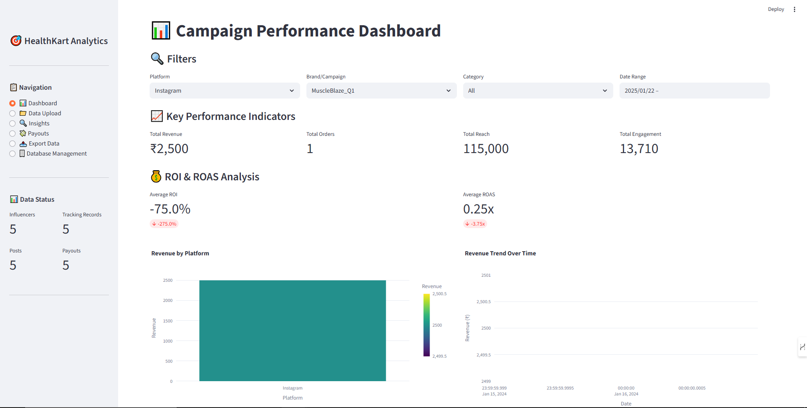
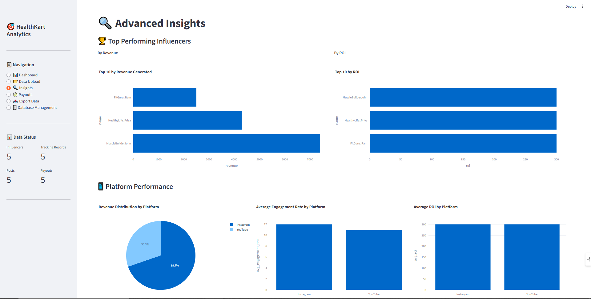
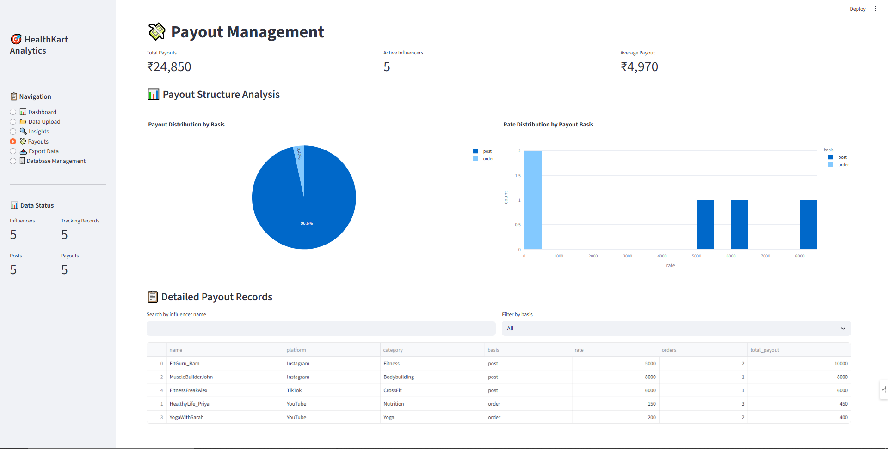

# HealthKart Influencer Campaign Dashboard

A comprehensive Streamlit-based dashboard for tracking and analyzing influencer campaign performance, ROI, and ROAS for HealthKart's multi-platform marketing initiatives.

## Live Demo

[Click here to view the live dashboard](https://trackerpro.streamlit.app/)  

---

## Features

- **Data Upload & Management**: CSV upload functionality for influencers, posts, tracking data, and payouts
- **Campaign Performance Tracking**: Real-time monitoring of campaign metrics across multiple platforms
- **ROI & ROAS Calculation**: Advanced analytics for return on investment and return on ad spend
- **Interactive Visualizations**: Dynamic charts and graphs using Plotly
- **Multi-Platform Support**: Track campaigns across Instagram, YouTube, Twitter, Facebook, TikTok, and LinkedIn
- **Influencer Insights**: Performance analysis by influencer category, platform, and engagement metrics
- **Payout Management**: Track and manage influencer payments based on posts or orders
- **Export Functionality**: Generate CSV reports and PDF insights
- **Advanced Filtering**: Filter data by brand, product, influencer type, platform, and date range

---

## Screenshots

### Dashboard

### Insights

### Payouts

---

